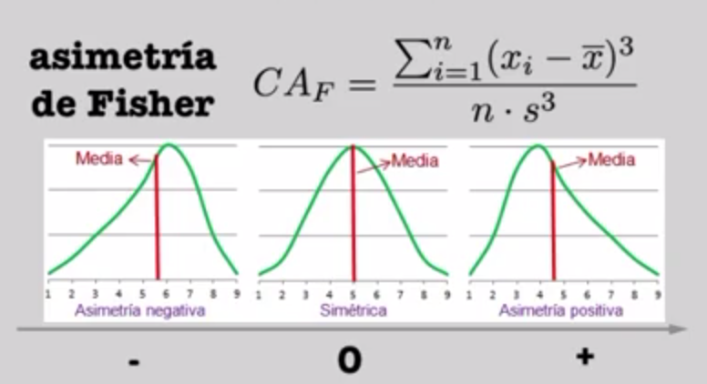

```{r setup, include=FALSE}
knitr::opts_chunk$set(echo = TRUE)
# install.packages("moments")
library(moments)
data(mtcars)
X <- mtcars$mpg
```

Trabajaremos con los datos de la variable mi/gal del `mtcars dataset`.

```{r}
data(mtcars)
X <- mtcars$mpg
```

# Medidas de centralización de los datos
## Media
```{r}
mean(X)  
# Es lo mismo que:
sum(X)/length(X)
```

## Mediana
```{r}
median(X)
# Es lo mismo que
sorted <- sort(X)
sorted[length(sorted)/2]
```

# Moda
- Es el elemento que más se repite en la serie de datos
```{r}
sort(table(X),decreasing=TRUE)
```

# Percentiles
$P(X <= x_p ) = p$
$p \in [0,1]$

```{r}
quantile(X)
```
El 0% es el mínimo y el 100% el máximo

# Medidas de dispersión de los datos (medir cuanto se separan los valores de la media)
## Varianza

- Siempre será conocida y positiva porque es una suma de cuadrados
- Introduce una nueva dimensión en los datos (el cuadrado de la dimensión original)

```{r}
paste( "La varianza es de", round(var(X), digits = 1), "(mi/gal)^2")
```

## Desviación típica
- Siempre será conocida y positiva porque es una suma de cuadrados
- NO introduce una nueva dimensión en los datos 

```{r}
paste( "La desviación típica es de", round(sd(X), digits = 2), "mi/gal")
```

## Coeficiente de variación
- Mide la variación relativa entre la media y la desviación típica
- Es la desviación estandar dividida por la media
```{r}
paste("El coeficiente de variación es de", round(sd(X)/mean(X) * 100), "%")
```

# Momento de orden r respecto de la media
Es la suma de todas las diferencias entre los elementos de la muestra elevado a r

$m_r = \frac{(x_i - \overline{x})^r}{n}$

- Se trata de una métrica teórica similar a la varianza y la desviación típica
- Es teórica porque a diferencia de estas, la muestra de orden r se divide entre **n**, al contrario que las anteires en las que se divide por **n-1** por lo que se pierde un elemento del muestreo

# Medidas de asimetría
- Se basan en los momentos de orden 3 y 4
- Si la ecuación da 0, la distribución es perfectamente simétrica


## Asimetría de Fisher 

- Si el valor es negativo, la media queda por debajo de la distribución (donde se concentra la mayor parte de los datos) y viceversa

```{r}
skewness(X)
```

Se ve que es ligeramente superior a 0, por lo que la media está por encima del resto de valores.



## Curtosis

- Habla del reparto de los datos respecto al centro y las colas
- Una curtosis positiva indicaría una distribución Leptocúrtica. Es decir, que tiene los valores muy concentrados en el centro y pocas colas
- Una curtosis = 0 daría una distribución mesocurtica, la más equilibrada en cuanto a centralidad y colas
- Una curtosis negativa indicaría una distribución platicúrtica, en la que los valores tendrían más presencia en las colas

```{r}
kurtosis(X)
```

El resultado indica que la distribución es leptocúrtica.


Haciendo un plot del histograma de los datos lo podremos comprobar.

```{r}
hist(X)
```

# Muestra aleatoria simple

- Todos los individuos tienen la misma probabilidad de ser elegidos
- Un individuo puede ser elegido más de una vez
- Nos sirve para inferir hipótesis sobre la población total a la que se está intentando representar con la muestra 

# Teorema Central del Límite

Al tomar una función de distribución de una población cualquiera (p. ej: las interacciones de las personas con justeat) y tomáramos una **cantidad de muestras de tamaño n** de estos datos, la media de esas muestras tiende a formar una función de distribución normal, sea cual sea la función de distribución inicial.

Cuantas más muestras tomemos y mayor sea n, la frecuencia de las medias de las muestras más se parecerá a la de una distribución normal.

# Contraste de Hipótesis

A partir de los conceptos anteirores, se toma una hipótesis relacionada con el valor que debe tomar un **estimador**, el cual debe estar por encima o por debajo de un determinado umbral.

Es decir, el contraste de hipótesis se utiliza para determinar si los resultados de un experimento tienen validez frente a los resultados históricos de ese experimento.

![(ratas.png)]

Al comprobar si las hipótesis se cumplan, estamos buscando la probabilidad de que se cumpla cada una de ellas. 

En el ejemplo, asumimos que la hipótesis H0 es verdad:


- **Usaremos un Z-test cuando n >= 30**
- **Usaremos un t-test cuando n < 30**
- La distribución de **t-student es similar a la normal** solo que **con unas colas más anchas**


## El p-valor 

- El p-valor es la probabilidad de que la hipótesis nula sea falsa 
- Se define como el nivel de significación, es decir, el opuesto al nivel de confianza
- En definitiva, cuando el p-valor es menor al nivel de significación, tendremos que rechazar la hipótesis nula


# Condiciones para la aceptación o rechazo de la hipótesis nula

- El contraste de hipótesis se puede hacer unilateral y/o bilateral

La siguiente figura resume las condiciones de aceptación o rechazo de la hipótesis nula para cada escenario en contrastes de hipótesis unilateral.


El contraste para las dos colas se haría igual solo que el estadístico (Z) estaría uno con signo negativo y el otro igual pero positivo; y $\alpha$ (nivel de significación) estaría repartido entre los dos lados, es decir, multiplicado por 1/2

## El test de Chi cuadrado

El test de chi cuadrado se emplea cuando queremos **contrastar los datos observados con los datos esperados**. 

- Depende del grado de libertad, que viene determinado por la cantidad de variables que tenemos.


### Bondad de ajuste

- Con una sola variable se trataría de un test de la bondad de ajuste a una distribución cualquiera.
- Para comprobar el ajuste, el estadístico (modelo) tiene unos valores de ajuste, para determinar el grado de significación.


- Como $x^2$ es mayor que $x^2_\alpha$ rechazamos la hipótesis nula.

### Test de homogeneidad e independencia

En este caso tenemos más de una variable (Carrera y género), y queremo comprobar si una variable es independiente de la otra.


# Correlación de variables

- Existen muchos tipos de correlación posibles

## Ejemplos
### Correlación lineal

$y=ax + b$


### Correlación exponencial

- No tiene por qué ser el número $e$, podría servir cualquier valor.

$y=e^{ax}+b$


## Coeficiente de correlación de Pearson

- Cuantifica/ cualifica el grado de correlación entre variables
- Se mueve en el rango $[-1,1]$
- Responde a la siguiente ecuación


- Una correlación **positiva** indica una relación **directa** (si una aumenta, la otra también)
- Una correlación **negativa** indica una relación **inversa** (si una aumenta, la otra disminuye)
- Un $r$ en el rango $[-0.5, 0.5]$ (en la literatura se puede encontrar el rango $[-0.64,0.64]$) indica que la relación se debe a una mera **causalidad** y que **la relación es débil**
- Cuando $r$ pasa a los rangos $[-1,-0.7]$ y $[0.7,1]$ ya se puede hablar de una relación fuerte
- La relación entre dos variables no indica necesariamente causalidad

**_Ver ejemplo en notebook "T2-1-Statistics-Correlacion"_**
